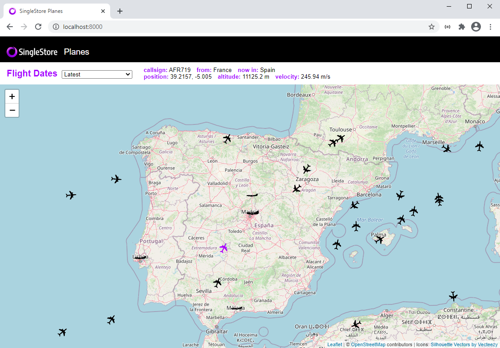
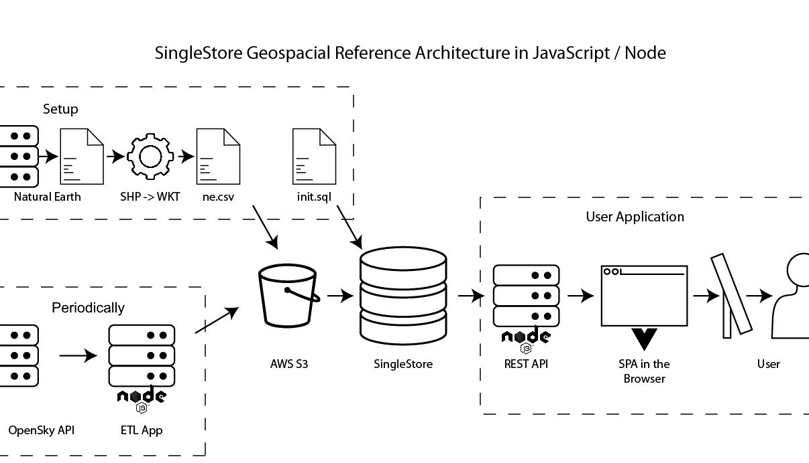

SingleStore Geospatial Reference Architecture in Node.js / JavaScript
=====================================================================

**Attention**: The code in this repository is intended for experimental use only and is not fully tested, documented, or supported by SingleStore. Visit the [SingleStore Forums](https://www.singlestore.com/forum/) to ask questions about this repository.

This sample app demonstrates using Geography data with SingleStore.

## Application Architecture

This application is broken into 3 main groups:

- Setup: these steps are done once to create tables and ingest pipelines in SingleStore, and to load Country data from a CSV file.

- Periodically: data is queried from the OpenSky API and written to an S3 bucket.  A SingleStore ingest pipeline automatically loads this data as soon as the S3 file is created.

- User Application: an Express API queries data and surfaces it to a Single Page Application (SPA) written in Vue.

## Setup

Choose an installation mechanism from the sections below to install:

- Managed Service: a fully managed database in the cloud

- Self-Managed with Containers: run the data stores and application on your local development machine

### Managed Service Installation Steps

1. [Sign up](https://msql.co/2E8aBa2) for SingleStore Managed Service.

2. Load data into AWS S3:

   Create an S3 bucket for `countries`.  From the `s3-data/countries` folder, load `natural_earth_countries_110m.csv` into the s3 bucket.  This file includes polygon data for country boundaries in WKT format.  This data was downloaded from https://www.naturalearthdata.com/downloads/ and converted from SHP to WKT.

   Create an S3 bucket named `flights`.  Flight data from https://opensky-network.org/apidoc/rest.html will get loaded here by the data-load app.

3. Open `init.sql` and adjust the S3 credentials to match your S3 bucket in both queries.

   Remove `, "endpoint_url":"http://minio:9000/"`.  "endpoint_url" is only needed if you're using an S3-compatible blob store.

   Set `aws_access_key_id` and `aws_secret_access_key` to match your AWS bucket.

   Set `region` to your AWS region.

   If you named your buckets differently or you have a folder inside your bucket, you may need to change the bucket name to the bucket name and folder name.  E.g. if I had a bucket named 'plane-app' and a folder inside named 'countries', I'd change the bucket from `countries` to `S3_BUCKET=plane-app/countries`

4. Spin up a SingleStore [Managed Service trial](https://msql.co/3iQ0SE8) cluster.

5. Copy `init.sql` into the query editor and run all queries to create the two tables and start the two data ingest pipelines.

6. Clone this GitHub repository or download the zip file and unzip it.

7. Adjust connection details in `docker-compose-managed-service.yaml` to point to your managed service cluster and S3 bucket.

   Set `S3_REGION`, `S3_BUCKET`, `S3_ACCESSKEY`, and `S3_SECRETKEY` to match your AWS S3 details for the flights bucket.

   If you have a folder inside your bucket, set `S3_FOLDER`.  E.g. if I have a bucket named `planes-app` and a folder inside named `flights`, then `S3_BUCKET=planes-app` and `S3_FOLDER=flights`.  Unfortunately we can't use the shorthand ~~'planes-app/flights'~~ used by piplines.

   Set `SINGLESTORE_HOST`, `SINGLESTORE_USER`, and `SINGLESTORE_PASSWORD` to the SingleStore cluster details.

8. Run `docker-compose -f docker-compose-managed-service.yaml build` to build all the containers.

9. Run `docker-compose -f docker-compose-managed-service.yaml up` to start the apps.

10. Browse to http://localhost:8000/ and watch the planes move.  Click on a plane to see the details, and choose a load date to see historical data.

11. When you're done, hit cntrl-c and run `docker-compose -f docker-compose-managed-service.yaml down` to stop all the containers.

## Install on self-managed cluster with Containers

1. [Sign up](https://msql.co/2E8aBa2) for a free SingleStore license. This allows you to run up to 4 nodes up to 32 gigs each for free.

2. Grab your license key from [SingleStore portal](https://msql.co/3fZoxjO) and set it into `docker-compose.yaml`.

3. Install [Docker Desktop](https://www.docker.com/products/docker-desktop) if it isn't installed already.

4. Run `docker-compose up` from your favorite terminal.

   This will spin up both a SingleStore cluster including [SingleStore Studio](https://localhost:8080), the web-based SQL query and administration tool.

   This will spin up MinIO, an S3-compatible blob store.

   The S3 data is automatically mapped into the MinIO container.  Two buckets are created automatically: `countries` and `flights`.

   The `init.sql` file is automatically run.  This creates the `maps` database with a table for `countries` and a table for `flights`.  It also creates a pipeline to ingest country and flight data from MinIO.

   This will also build and deploy the data loading app that pulls flight data from https://opensky-network.org/apidoc/rest.html and loads it into MinIO every 10 seconds.

   This will also build and start the Node.js app on http://localhost:8000.  This app consists of an Express API that queries the database and a Vue.js app that shows planes on a Leaflet map.

5. Browse to http://localhost:8000/ and watch the planes move.  Click on a plane to see the details, and choose a load date to see historical data.

6. When you're done, hit cntrl-c and run `docker-compose down` to stop all the containers.

## License

MIT
